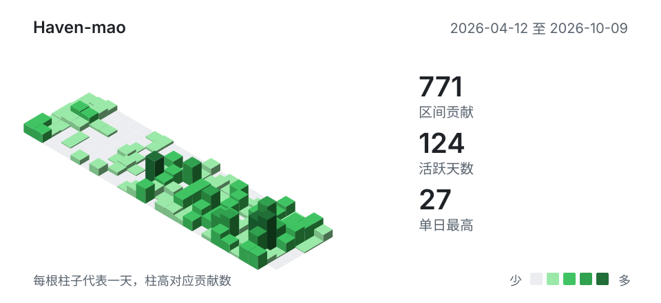

<h1>Hi, I'm Haven-mao 👋</h1>

<em><strong>while(alive){learn();}</strong></em>

关注大模型应用、RAG 知识库与 Agent / MCP。 
也喜欢全栈开发、Linux 与系统虚拟化、嵌入式 / 物联网，以及实用的效率工具。

<a href="mailto:keibunmao@gmail.com">📫 keibunmao@gmail.com</a>

<h2>Contribution Calendar</h2>

  <a href="https://github.com/Haven-mao?tab=overview">
    <picture>
      <source media="(max-width: 600px) and (prefers-color-scheme: dark)" srcset="./assets/contributions-3d-mobile-dark.svg">
      <source media="(max-width: 600px)" srcset="./assets/contributions-3d-mobile-light.svg">
      <source media="(prefers-color-scheme: dark)" srcset="./assets/contributions-3d-dark.svg">
      
    </picture>
  </a>

<h2>Tech Stack</h2>

<h3>常用</h3>

  
  
  

  
  

  
  
  
  
  
  

  
  
  

云服务器运维 · Kubernetes 集群

<strong>使用过的技术</strong>

 

  
  
  
  
  

  
  
  
  
  

  
  
  

  
  
  
  
  

  
  
  
  

<h3>学习中</h3>

  

<h2>Streak Stats</h2>

  <a href="https://github.com/Haven-mao">
    <picture>
      <source media="(prefers-color-scheme: dark)" srcset="https://streak-stats.demolab.com/?user=Haven-mao&amp;hide_border=true&amp;disable_animations=true&amp;background=0D1117&amp;currStreakNum=F0F6FC&amp;sideNums=F0F6FC&amp;currStreakLabel=F0F6FC&amp;sideLabels=9198A1&amp;dates=9198A1&amp;ring=3FB950&amp;fire=3FB950&amp;stroke=30363D">
      
    </picture>
  </a>

